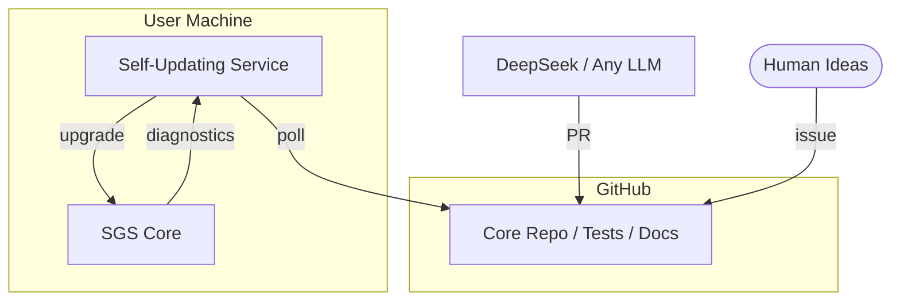

# 🚀 SGS.ai README

>*“Self-Generative Systems, re-imagined for humans and AIs alike.”*

---

## 1. TL;DR

SGS.ai is **open-source, self-updating, self-healing infrastructure** that lets you

```math
\text{think} → \text{describe in metadata} → \text{watch AI build, test, and ship.} 
```

No manual merges, no broken upgrades, no vendor lock-in.

---

## 2. Vision in One Sentence

> *“Give the system ideas; it gives you working software back.”*

---

## 3. Quick Start (60 s)

```bash
# 1. Bootstrap everything
bash <(curl -s https://raw.githubusercontent.com/alexmy21/SGS.ai/main/bootstrap.sh)

# 2. Verify it’s alive
./test_api.sh
# → Hello, SGS.core!  (200)
```

---

## 4. Table of Contents

1. [Core Ideas](#core-ideas)  
2. [Architecture at a Glance](#architecture-at-a-glance)  
3. [Von Neumann Reproduction Loop](#von-neumann-reproduction-loop)  
4. [HLLSet Algebra](#hllset-algebra) *(memory-frugal sets)*  
5. [Install Matrix](#install-matrix) *(Linux / macOS / Windows)*  
6. [Contributing & Ethics](#contributing--ethics)  

---

## 5. Core Ideas

| Principle | 15-word summary |
|---|---|
| **Stateless** | Entities identified only by content-hash → global deduplication for free. |
| **Immutable** | Once written, never overwritten; roll-forward via new versions. |
| **Idempotent** | Same input → same output, no matter how many times you run it. |
| **Metadata-driven** | Users express *what* they want; system decides *how*. |
| **Self-healing** | Failed upgrade? Automatic rollback in < 5 s. |

---

## 6. Architecture at a Glance



---

## 7. Von Neumann Reproduction Loop

Borrowing from von Neumann’s automata, the system continuously **copies, mutates, commits**:

| Transformer | Role | Formal Step |
|---|---|---|
| **A** – Universal Constructor | Build new entities | `A(Y) → Z` |
| **B** – Universal Copier | Deep-copy itself & siblings | `B(Y) → Y′` |
| **C** – Universal Controller | Orchestrate A, B, D | `C(X,Y) → X(Y)` |
| **D** – Environment Interface | Mutate for evolution | `D(Y′) → Y″` |

> Loop in 3 lines of pseudo-code

```python
foreach T in {A,B,C,D}:`  
    T′  = B(T)`  
    T″  = D(T′)`  
    T   = A(T″)` 
``` 

Garbage-collect unreachable entities **outside** the loop to keep RAM lean.

---

## 8. HLLSet Algebra

SGS.ai ships with `HllSets.jl`, a **memory-sipping set engine** (~1.5 kB for millions of keys).

```julia
using HllSets
a = HllSet(12)
add!(a, ["🍎","🍌"])
add!(a, "🍒")
count(a)  # => ≈ 3 (± 1 %)
```

**Set Ops Cheat-Sheet**  
`union`, `intersect`, `diff`, `set_xor`, `match` (Jaccard), `cosine`.

---

## 9. Install Matrix

| OS | 3-copy-paste lines |
|---|---|
| **Fedora 40** | `sudo dnf install podman podman-compose julia`<br>`python -m pip install --user podman-compose` |
| **Ubuntu 22+** | `sudo apt install podman podman-compose`<br>`wget -O - https://julialang.org/install.sh \| sh` |
| **macOS** | `brew install podman podman-compose julia`<br>`podman machine init && podman machine start` |
| **Windows (WSL2)** | `wsl --install` → then follow Ubuntu steps |

Verify:

```bash
podman --version && julia -e 'println("✅ Julia $VERSION")'
```

---

## 10. Contributing & Ethics

- **Open Source Forever**: Apache-2.0.  
- **AI Transparency**: Every AI-generated commit is tagged `deepseek-{hash}` and linked to the prompt.  
- **Human in the Loop**: High-level ideas, ethics review, and creative direction stay human.  
- **Want to join?** Open an issue, send a PR, or just discuss in Discussions.

---

## 11. References

1. A. Mylnikov, *Self-Generative Systems*, AISNS ’24. ([doi](https://doi.org/10.1145/3714334.3714392))  
2. [Thoughts on Collaborative Development #1 (PDF)](https://github.com/alexmy21/SGS.ai/blob/main/.PDF/Thoughts%20on%20Collaborative%20Development_1.pdf)  
3. [Thoughts on Collaborative Development #2 (PDF)](https://github.com/alexmy21/SGS.ai/blob/main/.PDF/Thoughts%20on%20Collaborative%20Development_2.pdf)  
… *(full list in repo)*

---

> **“The best system is the one that disappears—yet keeps working.”**  
> *—SGS.ai motto*