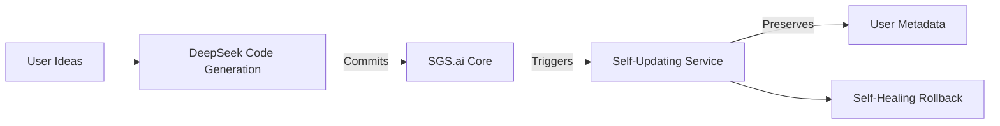

### SGS.ai: Self-Generative Systems for AI-Driven Development  
*Inspired by von Neumann's Self-Reproducing Automata*  

---

### **Core Vision**  
SGS.ai reimagines software development through **autonomous self-regeneration**, where AI systems build, optimize, and maintain themselves using von Neumann's principles of self-replication. This open-source framework enables:  
- **AI as the developer** (DeepSeek generates/test/commits code)  
- **Self-updating infrastructure** (GitHub-driven deployments)  
- **Self-healing resilience** (Automatic rollback on failure)  
- **User-centric immutability** (Metadata always preserved)  

> *"Humans define ideas → AI implements → Systems evolve autonomously."*  

---

### **Key Innovations**  
#### 1. **Self-Generative Architecture**  
Based on von Neumann's automata:  
| **Component** | **Role** | **Operation** |  
|---------------|----------|---------------|  
| **A: Constructor** | Creates new entities | `A(Y) → Z` |  
| **B: Copier** | Replicates systems | `B(Y) → Z` |  
| **C: Controller** | Orchestrates workflows | `C(X,Y) → X(Y)` |  
| **D: Perceptron** | Environment interface | `D(Y) → Z` |  

**Self-Reproduction Loop**:  
```  
Copy (B) → Mutate (D) → Commit (A) → Repeat  
```  

#### 2. **AI-Driven Development Pipeline**  
- **Idea → Code**: Human provides high-level concept → DeepSeek generates tested implementation  
- **GitHub Core**: AI commits validated code to central repository  
- **Self-Updating Clients**: User systems auto-upgrade while preserving custom metadata  

#### 3. **Probabilistic Foundation (HLLSet Algebra)**  
- **HyperLogLog-based sets** for efficient cardinality estimation  
- **Full set operations**: Union, intersection, difference  
- **Similarity metrics**: Jaccard, cosine similarity  
- **50% memory reduction** vs traditional implementations  

#### 4. **Self-Healing Mechanism**  
- Post-upgrade diagnostic checks (e.g., Redis/HDF5 connectivity)  
- Automatic rollback on failure  
- Metadata integrity guarantees  

---

### **Technical Highlights**  


**Key Workflow**:  
1. AI generates/test/commits code → GitHub  
2. Client services detect updates → Pull latest version  
3. System upgrades → Runs self-diagnostics  
4. On failure: Instant rollback + alert  

---

### **Why SGS.ai Matters**  
1. **Paradigm Shift**  
   - Redefines software lifecycle: Systems build/maintain *themselves*  
2. **Enterprise-Grade Benefits**  
   - Zero-downtime updates  
   - Metadata integrity by design  
   - Scalable to millions of custom workflows  
3. **Future of AI-Human Collaboration**  
   - Humans focus on *what* → AI handles *how*  
   - Open-source foundation for ethical co-creation  

---

### **Get Started**  
```bash  
# Bootstrap in one command  
bash <(curl -s https://raw.githubusercontent.com/alexmy21/SGS.ai/main/bootstrap.sh)  

# Verify installation  
curl http://localhost:8000  
# Response: {"message":"Hello, SGS.core!"}  
```  

**Join the Revolution**:  
[GitHub](https://github.com/alexmy21/SGS.ai) | [Whitepaper](https://doi.org/10.1145/3714334.3714392)  

---  
*"SGS.ai isn't just tools – it's organisms. They grow when you need, heal when broken, and evolve when challenged."*  
– Alex Mylnikov, Lead Architect  

> **Open Collaboration Welcome**: Contribute to our GitHub! All work remains open-source.