# 🧠 SGS.ai on-Chip

## 🎯 One-Pager Pitch

> A **fixed-topology, probabilistic brain-on-chip** that learns by *entangling* compressed sensor fingerprints (HLLSets) instead of updating weights.  
> Zero off-chip memory, sub-mW standby, and a direct migration path to hybrid quantum cores.

---

## 📋 Snapshot Table

| Feature | Classical NN | **SGS.ai Chip** | Quantum Future |
|---|---|---|---|
| Memory | DRAM traffic | **Latency-as-Memory** | Q-RAM hybrid |
| Learning | Weight updates | **Hash-collision entanglement** | Quantum kernel |
| Power | 10-100 mW | **<1 mW idle** | Cryo-ready |
| Explainability | Black-box | **Set algebra** | Phase-amplitude logs |

---

## 1. Architecture (30 s read)

```mermaid
graph TD
    subgraph Static Brain
        HLL[HLLSet Neurons<br/>m×b SRAM]
    end
    subgraph Perceptron Shell
        S[Forward Px<br/>Sensors → HLL]
        A[Backward Px<br/>HLL → Actuators]
    end
    subgraph Automata Loop
        C[Controller C]
    end
    S -->|hash| HLL
    HLL -->|Jaccard| A
    C -.->|mutate| HLL
```

---

## 2. Core Concepts (2 min)

| Concept | 1-Sentence Explanation |
|---|---|
| **HLLSet Neuron** | 64-bit register bank storing **probabilistic fingerprints** instead of floats. |
| **Entanglement** | Sensor hash **collisions** → cross-modal edges (graph inside the chip). |
| **Superposition** | Neuron states **{Active, Discharged, Sleeping}** mimic qubit decoherence. |
| **Latency Memory** | **Un-resolved signals** propagate through sub-lattice delays = short-term memory. |

---

## 3. Hardware Blocks

| Block | Function | Gate Count* |
|---|---|---|
| **Collision Detector** | Parallel XOR-popcount per register slice | 5 kGE |
| **Slice Systolic Array** | 1 PE per register, bit-serial | 20 kGE |
| **Sleep Timer RNG** | LFSR for stochastic sleep | 0.5 kGE |
| **Entanglement RAM** | 8-bit edge weights, 256 sensors | 2 kB SRAM |

\*Estimates for 1 k-neuron tile @ 28 nm.

---

## 4. Power States

| State | Active % | Current | Description |
|---|---|---|---|
| **Awake** | 100 % | 20 µA/neuron | Full propagation |
| **Doze** | 10 % | 2 µA | Clock-gated slices |
| **Sleep** | 0 % | 100 nA | Retention only |

---

## 5. Prototyping Roadmap 🗓️

| Phase | Milestone | Duration | KPI |
|---|---|---|---|
| **P0** | Cycle-accurate Python sim | 1 mo | 1 M events / s |
| **P1** | Xilinx ZCU102 (FPGA) | 3 mo | 0.8 mJ / inference |
| **P2** | 28 nm ASIC shuttle | 12 mo | 0.05 mm², 0.2 mW |
| **P3** | Cryo-quantum hybrid | 24 mo | 1 k-qubit co-processor |

---

## 6. Example Use-Cases

1. **Nano-drone** – 6-axis IMU + camera → 200 µW navigation.  
2. **Edge anomaly** – 8-sensor pipeline → on-chip change detection.  
3. **Quantum testbed** – Replace hash with **quantum phase estimation**.

---

## 7. Deliverables for Reviewers

| Artifact | Link / Status |
|---|---|
| **Python Simulator** | `pip install sgs-sim` |
| **FPGA Build** | `sgs-zcu102.bit` (GitHub releases) |
| **RTL** | `verilog/sgs_tile.sv` |
| **Tech docs** | This proposal + 8-page arXiv pre-print |

---

## 8. Call to Action

🛠️ Ready to tape-out a demo tile?  
📧 Open an issue or email `alexmy@lisa-park.com`.  
🔓 Everything Apache-2.0.

---

> *“The best AI chip is the one that disappears into physics.”*